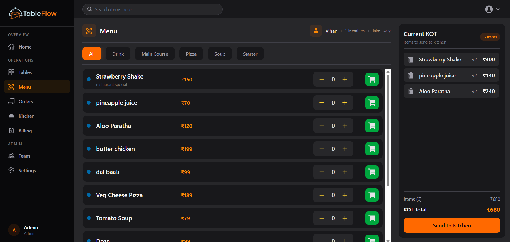
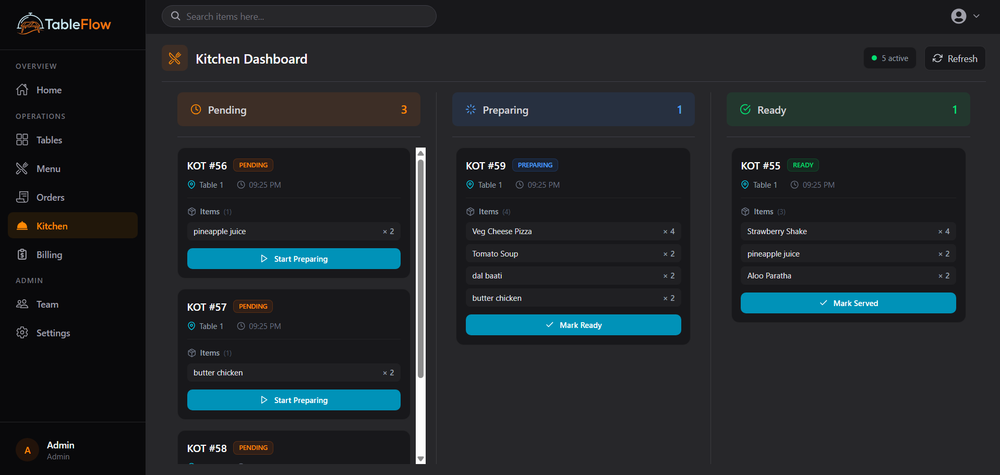
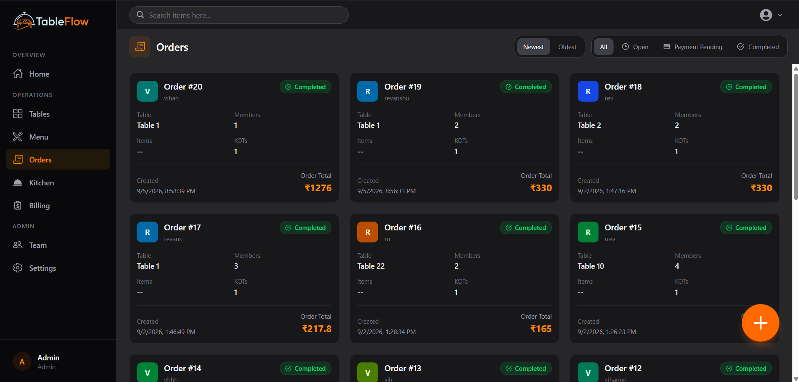
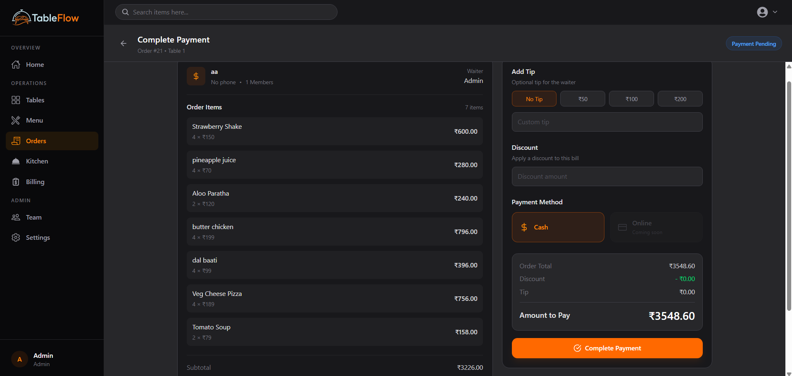
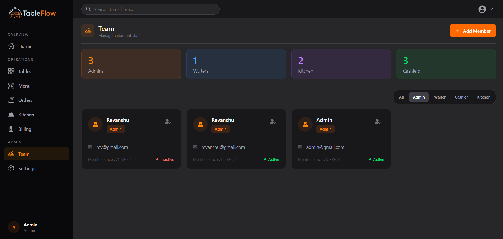

<div align="center">
  <h1>🍽️ TableFlow</h1>
  <p><strong>Real-Time Restaurant Operating System & POS</strong></p>
  <p>
    
    
    
    
    
  </p>
</div>

---

TableFlow is a full-stack, real-time restaurant management platform covering the complete dine-in workflow — from table assignment and order taking to kitchen coordination, billing, and receipt generation — with role-based access control for every staff tier.

## ✨ Features

- **Real-Time Order Flow** — WebSocket rooms per role (`kitchen`, `cashier`, `waiter`, `admin`) broadcast live order and KOT updates across all connected clients instantly
- **Kitchen Display System (KDS)** — KOT state machine (`PENDING → PREPARING → READY → SERVED`) with price snapshots at order time to prevent retroactive menu change impact
- **Billing & PDF Receipts** — Full billing workflow with tax, discount, and tip calculation; one-click A5 PDF receipt generation and browser print support
- **RBAC + Dual JWT Auth** — Four roles (`admin`, `waiter`, `kitchen`, `cashier`) enforced at every API route; access + refresh token rotation
- **ACID Transactions** — Atomic MongoDB transactions for order creation (table lock) and payment completion (table release)
- **Observability** — Pino structured logging with request IDs, per-route rate limiting, and a `/health` endpoint

## 👥 Role Access Matrix

| Role      | Tables | Menu | Orders | Kitchen | Billing | Team |
|-----------|:------:|:----:|:------:|:-------:|:-------:|:----:|
| Admin     | ✅ | ✅ | ✅ | ✅ | ✅ | ✅ |
| Waiter    | ✅ | 👁️ | ✅ | ❌ | ❌ | ❌ |
| Kitchen   | ❌ | 👁️ | 👁️ | ✅ | ❌ | ❌ |
| Cashier   | ❌ | ❌ | 👁️ | ❌ | ✅ | ❌ |

## 🖼️ Screenshots

| Menu & Order Taking |
|:-------------------:|
|  |

| Kitchen Display System |
|:----------------------:|
|  |

| Orders Overview |
|:---------------:|
|  |

| Billing & Payment |
|:-----------------:|
|  |

| Team Management |
|:---------------:|
|  |

## 🛠️ Tech Stack

| Layer | Tech |
|-------|------|
| Frontend | React 19, Vite, Tailwind CSS v4, Redux Toolkit |
| Backend | Node.js, Express 5, Socket.io 4.8 |
| Database | MongoDB (Mongoose 9), ACID transactions |
| Auth | JWT (access + refresh), bcrypt |
| PDF | jsPDF + jspdf-autotable |
| Testing | Vitest, Supertest, MongoMemoryReplSet |
| Logging | Pino, pino-http |

## 🚀 Getting Started

**Prerequisites**: Node.js 20+, MongoDB 7+

```bash
# Clone
git clone https://github.com/<your-username>/tableflow.git
cd tableflow

# Backend
cd backend
cp .env.example .env        # fill in MONGO_URI, JWT_SECRET, etc.
npm install && npm run dev

# Frontend (new terminal)
cd frontend
cp .env.example .env        # set VITE_API_URL
npm install && npm run dev
```

Open `http://localhost:5173` — seed an admin account via `POST /api/v1/auth/register`.

## 🧪 Testing

```bash
cd backend && npm test
# 39 tests across 6 suites — auth, orders, kitchen tickets, billing, RBAC
```

## 📄 License

MIT